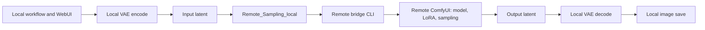
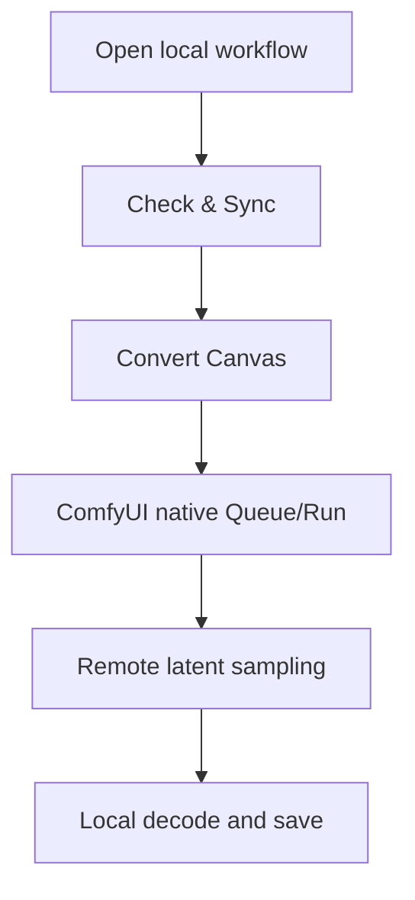

# Architecture

## Privacy Boundary



The remote server receives latent tensors, conditioning and sampler parameters. It should not receive RGB input images and should not save RGB output images for remote sampling jobs.

## Main Layers

- Frontend workflow controller: `ComfyUI-Remote-Sampling/web/remote_workflow_runtime.js`
- Workflow runtime backend: `ComfyUI-Remote-Sampling/workflow_runtime.py`
- Workflow analysis: `workflow_analyzer.py`
- Runtime conversion: `runtime_conversion.py`
- Resource planning: `resource_planner.py`
- Custom node planning: `custom_node_planner.py`
- Local sampling node: `nodes/remote_sampling_local.py`
- Remote sampling node: `nodes/remote_sampling_remote.py`
- Bridge CLI: `tools/remote_sampling_job_cli.py`
- Remote service manager: `tools/remote_comfy_service.py`

## Workflow-Level Run Bundle

Each `Check & Sync` or `Convert Canvas` creates:

```text
runs/workflow_runtime_<timestamp>_<id>/
  source_prompt.json
  source_workflow.json
  workflow_analysis.json
  resources_plan.json
  resources_diff.json
  resources_sync_report.json
  custom_nodes_plan.json
  remote_environment_report.json
  remote_custom_node_dependency_install.json
  remote_custom_node_import_smoke.json
  converted_local_prompt.json
  remote_execution_plan.json
  runtime_conversion_manifest.json
  workflow_status.json
  workflow_events.jsonl
  workflow_runtime_report.txt
  manifest.json
```

The manifest binds converted outputs to source prompt/workflow hashes. This prevents stale converted workflows from silently contaminating new runs.

## Node-Level Job Bundle

When ComfyUI's native Queue/Run executes a converted workflow, every `Remote_Sampling_local` creates:

```text
jobs/remote_sampling_<timestamp>_<id>_<sampler_id>/
  inputs.pt
  output.pt
  job.json
  status.json
  events.jsonl
  result.json
  remote_sampling_report.txt
```

`status.json` contains transfer and sampling metrics. `events.jsonl` records append-only events. `remote_sampling_report.txt` is the readable summary returned to ComfyUI.

## Resource Sync

The resource planner mirrors local `ComfyUI/models` relative paths to remote `ComfyUI/models`. Sync is fail-closed:

- Missing local resource blocks conversion.
- Missing remote resource is uploaded before canvas conversion when auto-sync is enabled.
- Size/hash mismatches are reported.
- `sha256_required` can force local/remote SHA256 verification.

## Custom Node Environment

The custom-node planner maps workflow classes to local packages. The runtime then:

1. Checks remote package existence.
2. Archives and syncs missing packages.
3. Writes dependency install plans.
4. Runs remote `object_info` import smoke.

If the workflow has no custom nodes, this whole remote custom-node phase is skipped and recorded as `remote_environment_short_circuit: true`.

## Remote Service Locking

Remote ComfyUI on port `8197` is serialized with a lock directory under:

```text
/home/user/remote_ComfyUI/locks/
```

This prevents concurrent bridge jobs from killing or stealing the same remote service.

## Formal User Flow



`Run Guarded` is not the formal daily entry. The formal entry is canvas conversion followed by ComfyUI's native execution.
